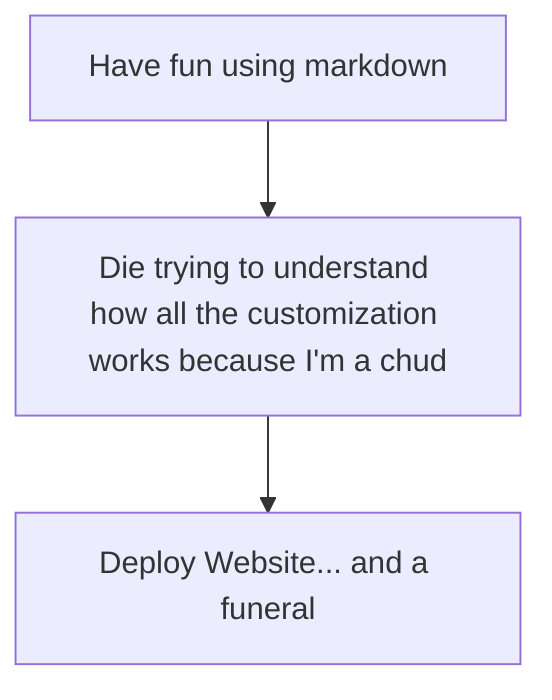

# About

## Project Overview

This microsite was created as part of a Technical Writing course assignment to explore the Docusaurus documentation framework. The project demonstrates how Docusaurus can be used to organize information into a simple, easy-to-navigate website.

## Purpose

The purpose of this microsite is to practice:

- Creating documentation using Markdown
- Organizing content with navigation
- Customizing the appearance of a Docusaurus site
- Using Git and GitHub for version control
- Publishing a documentation website

## About Docusaurus

Docusaurus is an open-source static site generator designed for building documentation websites. It uses Markdown for content and provides built-in navigation, themes, and deployment options.

## Project Scope

This microsite includes a customized homepage, an About page, a Contact page, updated navigation, and visual customization to demonstrate the core features required for the assignment.

## Reflection

Before this assignment, I had little experience working with website documentation frameworks. Building this microsite provided an introduction to Docusaurus, Markdown, GitHub, and website customization while reinforcing the importance of organizing technical information in a clear and accessible format.

